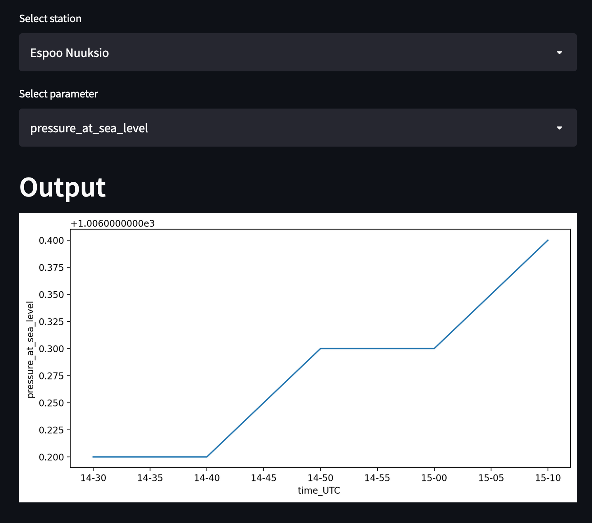

# api-kafka-spark-mongodb-streamlit_pipeline
## Purpose of the project

This project has several goals:

1. Read [Finnish Meteorological Data Institute data](https://en.ilmatieteenlaitos.fi/open-data) on weather observations from Finnish stations
2. Create simple data ingestion API with FastAPI
3. Use Apache Kafka to buffer incoming messages with observations
4. Use Spark to subscribe to Kafka
5. Stream with Spark messages to MongoDB
6. Query MongoDB and visualize data with the help of Streamlit
7. Overarching purpose - containerize everything down the pipeline starting from ingestion app

All scripts are writen in Python.
Diagram:

## Steps to create pipeline

The parts of the project were built gradually as if "growing on layers" and can be roughly broken down to the following steps:
1. Write FMI [data client](https://github.com/ksenia-tabakova/api-kafka-spark-mongodb-streamlit_pipeline/tree/main/fmi-client)
2. Write [ingestion API](https://github.com/ksenia-tabakova/api-kafka-spark-mongodb-streamlit_pipeline/tree/main/ingestion%20API) using FastAPI framework; test it with Postman
3. [Add Kafka to the pipeline](https://github.com/ksenia-tabakova/api-kafka-spark-mongodb-streamlit_pipeline/tree/main/Kafka). Kafka runs on container and production of kafka strings to ingestion API code added. Create local producer and consumer. Test new setup with Postman.
5. Containerize Ingestion API app and test pipeline with Postman.
6. [Add Spark to the pipeline](https://github.com/ksenia-tabakova/api-kafka-spark-mongodb-streamlit_pipeline/tree/main/Spark): spark runs on container using jupyterlab. Start Spark session, subscribe to the kafka topic to listen to the messages. Create second topic on Kafka for Spark output to test that Spark is working correctly.
7. [Add MongoDB to the pipeline](https://github.com/ksenia-tabakova/api-kafka-spark-mongodb-streamlit_pipeline/tree/main/MongoDB). MongoDB runs on container. Add to Spark script data processing and write to MongoDB database. Test that data is recorded correctly.
8. Now when all parts of pipeline work correctly, database can be populated with data. 
9. Add [Streamlit to the pipeline](https://github.com/ksenia-tabakova/api-kafka-spark-mongodb-streamlit_pipeline/tree/main/Streamlit): streamlit connects to MongoDB and queries data. Interactive dashboard is created to display queried data. 

Streamlit app example:

